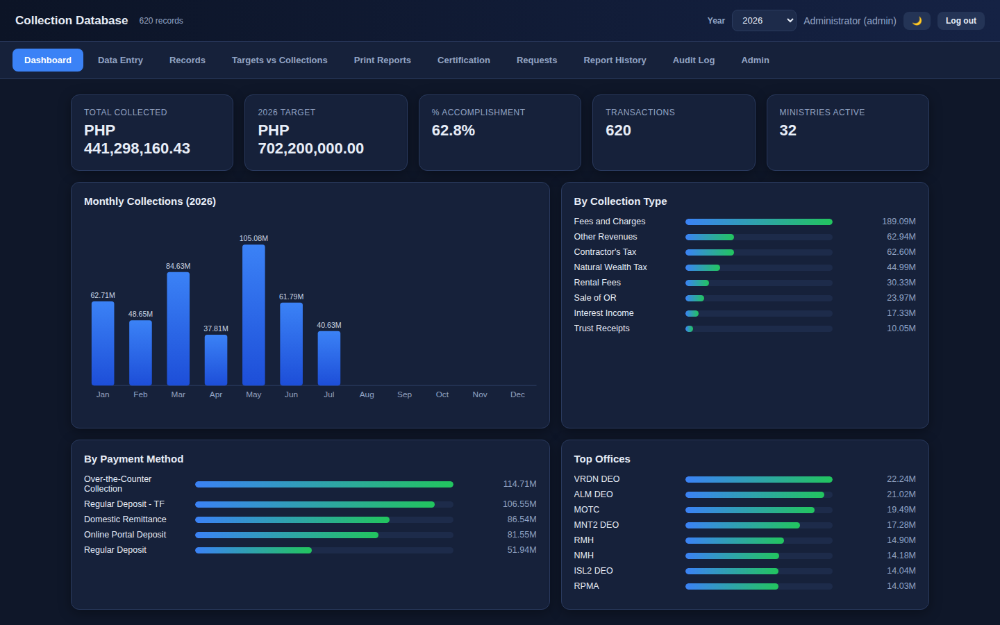
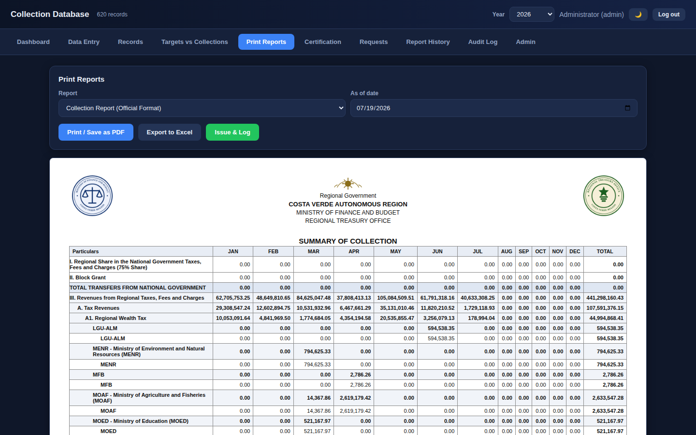
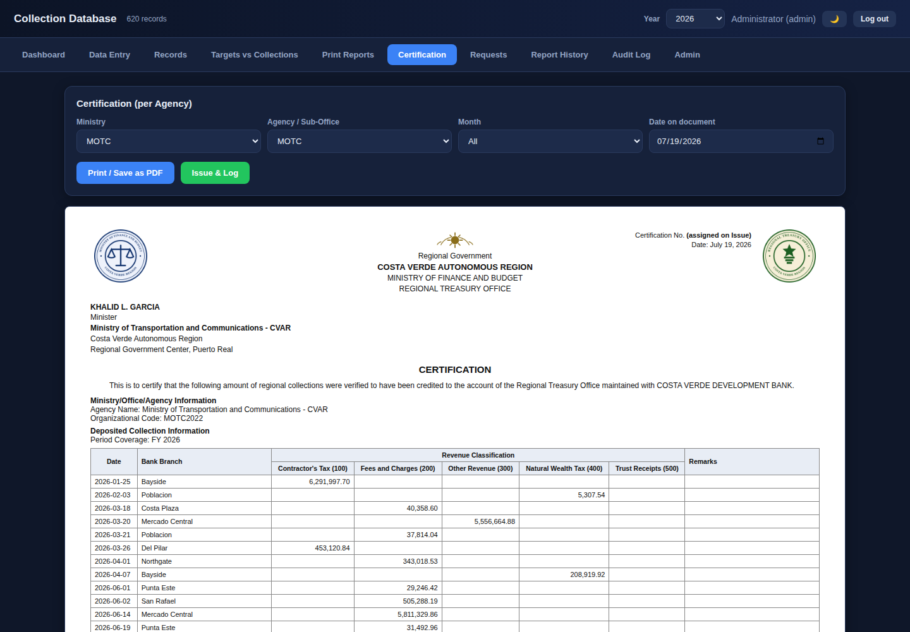

# Collections Management System

A multi-user collections and remittance tracking system built for the treasury office of a regional government in the Philippines. It replaced a formula-heavy Google Sheets workbook with a self-hosted web application that runs on a single office PC and serves the whole team over the office LAN — with per-user logins, role-based access, an append-only audit trail, and official printable reports and certifications.

> **⚠️ Everything in this repository is fictionalized.** The deploying office's identity is withheld; the region ("Costa Verde"), every ministry and agency, all officials' names, seals, bank branches, account numbers, transactions, and targets are invented sample data for demonstration. No real government data, entities, or persons appear here.



## Why it exists

The office tracked regional collections (~PHP 200M+/year across 30+ ministries and agencies) in a shared spreadsheet. That meant Google-only formulas that broke in Excel, no access control, no audit trail, and error-prone manual report assembly. This system replaces that workflow end to end:

- **Phase 1** — a single-file offline HTML app (no install, runs from a double-click, data in localStorage) that reproduced the workbook's dashboards and reports with live JavaScript calculations. See [`demo/`](demo/).
- **Phase 2** — the production system: a Flask + SQLite server used by the whole office in a browser, with logins and roles. This is the main codebase in [`server/`](server/).

## Features

**Data entry** — picking an org code auto-fills ministry, office, and clearing account (replaces VLOOKUP chains); dates auto-derive year/month/day; keyboard-first autocomplete for fast encoding.

**Reporting** — five report types including a Summary of Collection matrix (group × 12 months), a Collection Report by revenue class, a quarterly summary, an itemized ledger, and a nested I/II/III/IV "official format" report matching the office's mandated layout — every one printable on official letterhead with signature blocks, exportable to CSV/Excel.

**Certifications** — per-agency certification generator with letterhead seals, amount-in-words, sequential `YYYY-MM-###` numbering, consolidated multi-office certification groups, and an issued-document history with tamper-evident snapshots (the server recomputes and stores issued figures).

**Access control** — four roles (admin / encoder / certifier / viewer) enforced server-side, PBKDF2 password hashing, login throttling, no shipped default password (a strong random admin password is generated at build time).

**Audit** — append-only audit log recording every add/edit/delete with the real logged-in user.

**Operations** — hot backups, Excel import/export (with formula-injection hardening on every user-supplied cell), point-and-click Windows setup scripts for a non-technical office, and light/dark themes.




## Architecture

```
Browser (SPA, single static/index.html — vanilla JS, no framework)
        │  JSON over HTTP, session cookies
Flask (app.py — routes, role gates)  ── auth.py (sessions, throttle)
        │
db.py (queries, report builders, audit)  ── schema.sql (SQLite, CHECK constraints, indexes)
        │
collection.db (single SQLite file on the office PC; hot backups via backup.py)
```

Deliberate choices for the deployment reality (one office PC, non-technical operators, no internet dependency):

- **SQLite over a client-server RDBMS** — one file to back up, zero administration, more than enough for one office's write volume.
- **No frontend framework, no CDN** — a single static HTML file with inline SVG charts; works fully offline and deploys by copying one file.
- **Server-side everything** — validation, role checks, and derived fields (year/month from date) are computed on the server; the client is never trusted.

## Security posture

Built for a LAN deployment but hardened like it matters (it does — it handles a regional government's collection records): parameterized SQL throughout, output escaping at every render sink, CSV/Excel formula-injection neutralization, request size caps, login lockout, weak-password rejection, append-only audit, and role gates on every route. The codebase went through multiple adversarial security reviews before go-live; findings and fixes are documented in the commit history of the private deployment.

## Run it

```bash
cd server
pip install -r requirements.txt
python3 import_data.py --seed ../demo/_build_sources/seed.json --force   # builds collection.db from sample data; prints the admin password
python3 app.py                                                           # http://localhost:5057
```

Or try the **Phase 1 single-file demo**: open [`demo/demo.html`](demo/demo.html) in any browser — no install, no server, sample data included.

Windows point-and-click setup for an office deployment: see [`server/WINDOWS-SETUP.md`](server/WINDOWS-SETUP.md) and [`docs/DEPLOY.md`](docs/DEPLOY.md).

## Repo map

| Path | What it is |
|---|---|
| `server/` | The production Flask + SQLite application |
| `server/schema.sql` | Relational schema — keys, CHECK constraints, append-only audit |
| `server/db.py` | Query layer: report builders, certification logic, audit writes |
| `server/static/index.html` | The whole SPA (vanilla JS, inline SVG charts) |
| `demo/` | Phase 1 single-file offline app + build script + sample seed |
| `docs/` | Deployment guide and screenshots |

## License

MIT — see [LICENSE](LICENSE).
